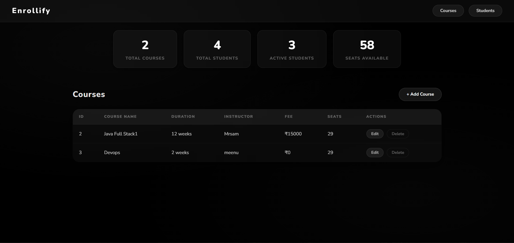
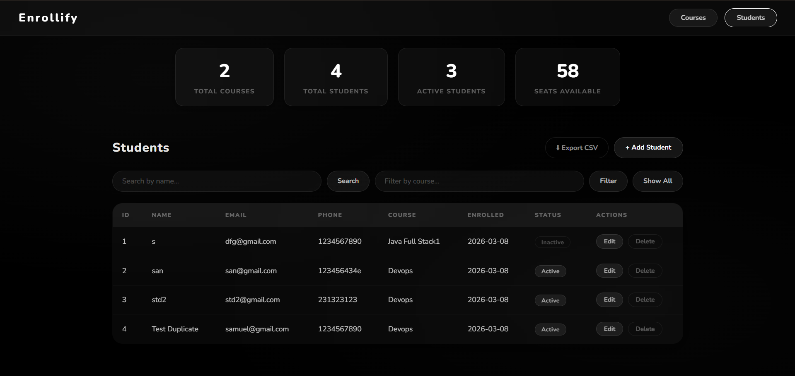

# Enrollify - Student Course Registration System

I built this project as part of my training assessment. It is a full stack web application where college staff can manage courses and enroll students into them. The system automatically reduces seats when a student is enrolled and blocks enrollment if no seats are available.

---


## What I Used

- Java 17
- Spring Boot
- Spring Data JPA + Hibernate
- MySQL 8
- HTML, CSS, JavaScript (Fetch API)
- Swagger UI (for API testing)

---

## What This Project Does

- Add, Edit, Delete Courses
- Enroll Students into a Course
- Seats automatically reduce when a student enrolls
- If no seats are available, enrollment is blocked
- Duplicate email registration is prevented
- Search students by name
- Filter students by course name
- Export student list as CSV file
- Dashboard stats showing total courses, students, active students and available seats
- Black Glass UI design
- Console App version using Core Java (no Spring Boot) in the console-app folder

---

## Project Structure

```
enrollify/
├── console-app/
│   └── Main.java              → Core Java version with ArrayList and HashMap
│
├── src/main/java/com/institute/scrs/
│   ├── model/
│   │   ├── Course.java
│   │   └── Student.java
│   ├── repository/
│   │   ├── CourseRepo.java
│   │   └── StudentRepo.java
│   ├── service/
│   │   ├── CrsService.java
│   │   └── StdService.java
│   ├── controller/
│   │   ├── CrsController.java
│   │   └── StdController.java
│   └── exception/
│       └── GlobalExceptionHandler.java
│
└── src/main/resources/
    ├── application.properties
    └── static/
        ├── index.html
        ├── style.css
        └── app.js
```

---

## How to Run

**Step 1 - Create the database in MySQL**
```sql
CREATE DATABASE scrs_db;
```

**Step 2 - Update application.properties with your MySQL password**
```properties
spring.datasource.url=jdbc:mysql://localhost:3306/scrs_db
spring.datasource.username=root
spring.datasource.password=your_password_here
```

**Step 3 - Run the application**
```bash
./mvnw spring-boot:run
```

**Step 4 - Open in browser**
```
http://localhost:8080
```

**Step 5 - Test APIs using Swagger**
```
http://localhost:8080/swagger-ui/index.html
```

---

## How to Run Console App

```bash
cd console-app
javac Main.java
java Main
```

---

## API Endpoints

| Method | Endpoint | What it does |
|--------|----------|--------------|
| GET | /api/courses | get all courses |
| POST | /api/courses | add new course |
| PUT | /api/courses/{id} | update course |
| DELETE | /api/courses/{id} | delete course |
| GET | /api/courses/stats | get course stats |
| GET | /api/students | get all students |
| POST | /api/students | enroll student |
| PUT | /api/students/{id} | update student |
| DELETE | /api/students/{id} | delete student |
| GET | /api/students/search?name= | search by name |
| GET | /api/students/filter?crsName= | filter by course |
| GET | /api/students/stats | get student stats |

---

## Important Logic

The main business logic is in `StdService.java` inside the `addStudent()` method:

1. First it checks if the email is already registered — if yes throws error
2. Then it fetches the course by id
3. Checks if availableSeats is greater than 0 — if not throws "No seats available"
4. If seats are there it decrements the seat count and saves the student
5. enrollDate is automatically set to today's date

---

## Database

Two tables are created automatically by Hibernate:

**courses table**
- id, crs_name, duration, instructor_name, crs_fee, available_seats

**students table**
- id, std_name, email, ph_number, enroll_date, status, course_id (foreign key)

One course can have many students (OneToMany relationship)

---

## Made by

Samuvel Johnson
